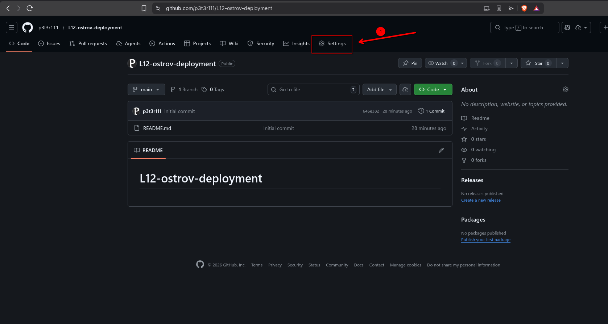
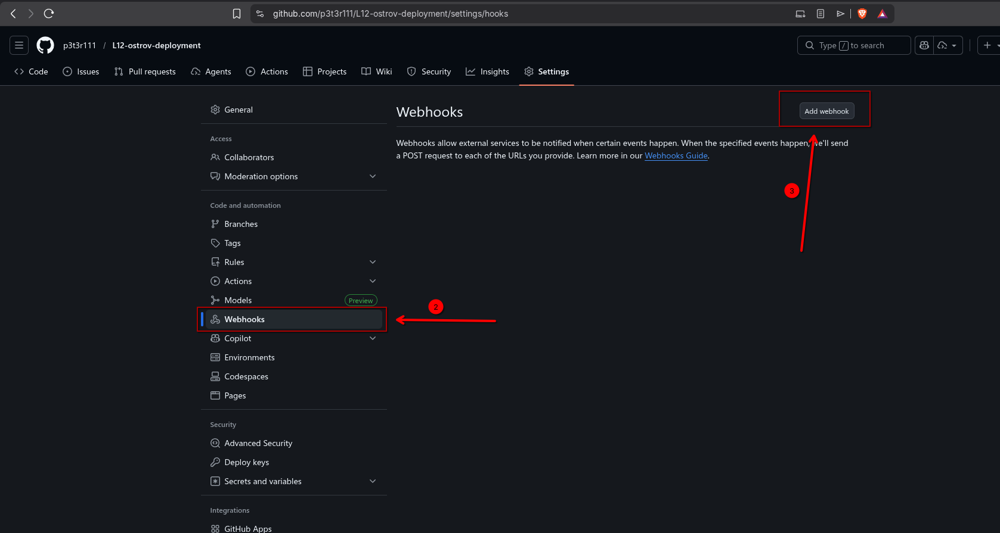
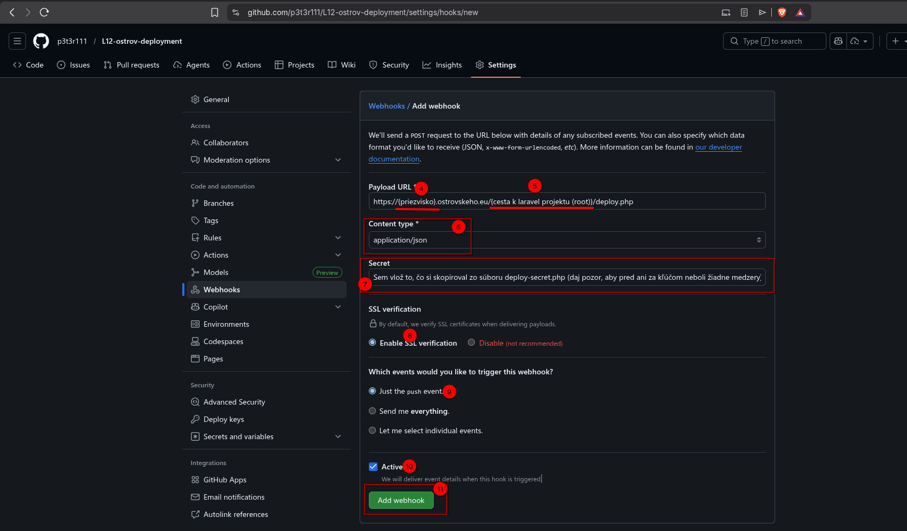

# L12-ostrov-deployment

# Inštalácia do laravel projektu

**Ak nemáš svoj projekt na githube (mal by byť súkromný) tak ho dostan na github až potom pokračuj**

1. Pridaj do .gitignore -> `public/deploy-secret.php`

2. Ako pridam tieto veci k sebe do projektu?
- `git clone https://github.com/p3t3r111/L12-ostrov-deployment.git`
- zmaž si /docs a README.md - sluzia len ako dokumntácia alebo si README.md možeš upraviť pre svoj projekt
3. zapni si lokalne projekt a chod na `localhost:8000/deploy-secret.php` a pokračuj na sekciu tu v dokumntacii : **Vytvorenie Webhooku** (Úplne dole)

# Vytvorenie Webhooku
## 1. krok
Chod na svoj github projekt -> záložka **Settings**

## 2. krok
Chod do sekcie **Webhook** a potom klikni na **Add Webhook**

## 3. krok
Samotné vytváranie webhooku:

4. a 5. bod - vyplni podla seba - root = hlavny priečinok, čiže ak sa tvoj projekt vola laravel tak root priecinok je laravel, nie laravel/public alebo laravel/app

6. bod - prepni na `application/json`

7. bod - spusti lokálne u seba na pc `localhost:8000/deploy-secret.php`, skopíruj to čo ti to vyhodí (ak to je error tak ho najprv vyrieš a potom pokračuj dalej) a vlož to do toho pola, bacha na medzeri pred alebo za klucom (nesmu tam byt)

8. bod - nechaj tak ako je

9. bod - nechaj tak ako je

10. bod - nechaj zaškrtnuté active

11. bod - skontroluj, že máš všetko dobre zadané, ak áno potvrď vytvorenie webhooku

